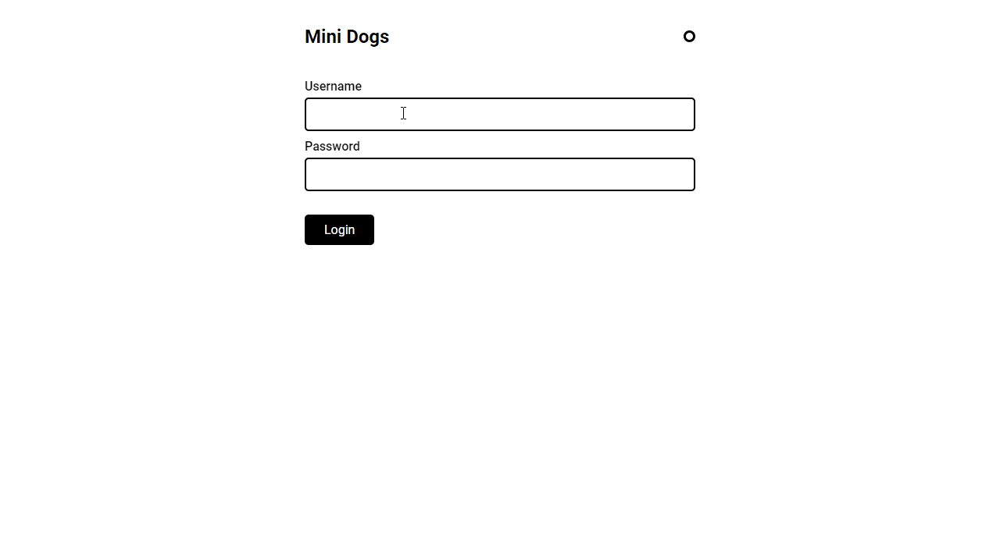

# Mini InstaDogs: Redux

This project is a small app with a login form and a feed of dogs' photos and it uses Redux to manage the global state. The goal of the project was to practice Redux and it's part of the Redux with React course from [Origamid](https://www.origamid.com/curso/redux-com-react/), a Brazilian learning platform. It's a mini version of the [InstaDogs project](https://github.com/julianachagas/instadogs) developed in the React course.

This project was bootstrapped with [Create React App](https://github.com/facebook/create-react-app).

Test Account:

- Login: dog
- Password: dog

The API used in the project (for user authentication and for fetching the photos) was created by Origamid.

## 🛠️ Technologies

- HTML
- CSS Modules
- [React](https://pt-br.reactjs.org/)
- [Redux](https://redux.js.org/)

## 💡 Features

✔️ User authentication: login and auto login (using local storage) \
✔️ Feed of recent photos \
✔️ Button to load more photos \
✔️ Loading animation \
✔️ Responsiveness \
✔️ Logout

## 🔗 Link

- Live Site URL: [Mini InstaDogs](https://mini-instadogs.netlify.app/)

## 💻 Preview

 <br/><br/>

## ⚙️ How to use

To clone and run this project you'll need [Node.js](https://nodejs.org/en/) and [Git](https://git-scm.com) installed on your computer. In addition, it is good to have an editor to work with the code like [VSCode](https://code.visualstudio.com/). Follow the instructions bellow:

```bash
# Clone this repository
$ git clone https://github.com/julianachagas/mini-instadogs.git

# Go into the repository
$ cd mini-instadogs

# Install the dependencies
$ npm install

# Run the app in development mode
# Open http://localhost:3000 to view it in your browser
$ npm start

# Build the app for production to the `build` folder
# It correctly bundles React in production mode and optimizes the build for the best performance.
$ npm run build

```

## 👩🏻‍💻 Author

<a href="https://www.linkedin.com/in/juliana--chagas/" target="_blank"></a>
<a href="https://twitter.com/JulianaCoding" target="_blank"></a>

---

##### Made with 💜 by Juliana Chagas
